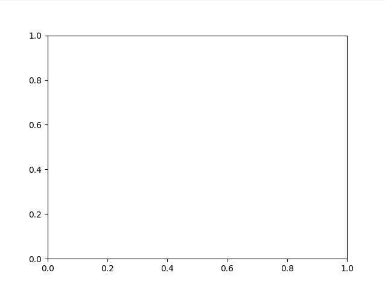
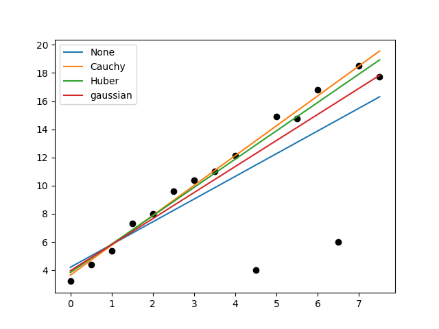

## Solve Nonlinear Least-Squares Problem with the Gauss-Newton Methods.  
### What is linear/nonlinear?  
* Linear: A polynomial of degree 1.  
* Nonlinear: A function cannot be expressed as a polynomial of degree 1.

### What is Least-Squares Problem?  

Given a residual function r(x), where x is the parameter vector, the least-squares problem aims to find the optimal parameters that minimize the sum of squared residuals.

The objective function F can be defined as:

$$ 
F = \sum_{i=0}^{n} (r^T \Sigma^{-1} r) \tag{1}
$$

Here, $\Sigma$ is the covariance matrix for the measurement. and the inverse of $\Sigma$ is often referred to as the information matrix. In simpler cases, it can be the identity matrix.

### What is Gauss-Newton Methods?  
The Gauss-Newton methods are used to solve nonlinear least-squares problems. Unlike Newton's method, Gauss-Newton methods do not require the calculation of second derivatives of the residual function, which can be difficult in some cases.

Taylor expansion around the initial guess x.

```math 
\begin{aligned}
F &= \sum_{i=0}^{n} (r(x + \Delta{x})^T \Sigma^{-1} r(x + \Delta{x})) \\
&= \underbrace{\sum (r^T  \Sigma^{-1} r)}_\textrm{c} +
2 \underbrace{\sum(r^T \Sigma^{-1} J)}_\textrm{g} \Delta{x}+ 
 \Delta{x}^T \underbrace{\sum(J^T \Sigma^{-1} J)}_\textrm{H} \Delta{x}
\end{aligned}
```


Here,  c represents a constant, g is the gradient vector, and H is the Hessian matrix of F.

$$ 
g = \sum g_i= \sum J_i^T \Sigma^{-1} r_i \tag{2}
$$

$$ 
H  = \sum H_i \approx \sum J_i^T \Sigma^{-1} J_i  \tag{3}
$$

* r is the residual vector. 
* J is the jacobian matrix of r.

To find the minimum value of F, we differentiate the right side of the equation and set it equal to 0.

$$ 
\begin{aligned}
\dot{F} &=  
\partial(c + 2 g \Delta{x}+ 
\Delta{x}^TH \Delta{x}) / \partial{\Delta{x}}  \\
&=  2 g + 
2H \Delta{x} = 0
\end{aligned}
$$

Therefore, when dx is equal to (4), the value of F is a minimum.

$$ 
\Delta x = -H^{-1}g \tag{4}
$$

Since F may be nonlinear function, we can approximate the optimal x using iterative methods.


### The problem of 3D points matching

If we define the increment of SO3/SE3 as:

$$T(x_{0}\boxplus\delta) \triangleq T(x_{0})\exp( \delta ) \tag{5} $$ 

The $\delta \in \mathfrak{so}(3)$ or $\delta \in \mathfrak{se}(3)$

We use a first-order Taylor expansion to approximate the original equation:  

$$T(x_{0}\boxplus\delta) = T_{0}\exp( \delta ) \cong T_{0} + T_{0}\widehat{\delta} \tag{6} $$

The the residual function of 3D points matching problem can be defined as: 
$$r(x) = T(x)a - b \tag{7} $$

a is the target point:
b is the reference point.

We can use gauss-newton method to solve this problem.
According to gauss-newton method, we need to find the Jacobian matrix of r


$$
\begin{aligned}
\dot{r} &= \frac{T_{0}\exp\left( \delta \right)a - T_{0}a}{\delta} \\
&\cong \frac{T_{0}a + T_{0}\widehat{\delta}a - T_{0}a}{\delta}  \\
&= \frac{T_{0}\widehat{\delta}a}{\delta}  \\
&= - \frac{T_{0}\delta\widehat{a}}{\delta}  \\
&= - T_{0}\widehat{a} 
\end{aligned}
\tag{8} 
$$

### When $\delta \in \mathfrak{so}(3)$
$T_0$ is a 3d rotation matrix($R_0$),
and $\widehat{a}$ is defined as a skew symmetric matrix for vector $a$

$$\dot{r} = - R_{0}[ a ]_{\times}  \tag{9}$$

###  When $\delta \in \mathfrak{se}(3)$

$$\delta = [\ v, \omega ] \tag{10}$$

$\omega$: the parameters of rotation.

$v$: the parameters of translation.

$$
\widehat{\delta} = \begin{bmatrix}
[ \omega ]_{\times} & v \\
0 & 0 \\
\end{bmatrix} \tag{11}
$$

```math
\begin{aligned}
\dot{r} 
&= \frac{R_{0}\widehat{\delta}a}{\delta} \\
&=\frac{T_{0}\begin{bmatrix}
[ \omega ]_{\times} & v \\
0 & 0 \\
\end{bmatrix}
\begin{bmatrix}
a \\
1 \\
\end{bmatrix}}
{[v,\omega ]} \\
&= \frac{T_{0}\begin{bmatrix}
I & [ - a ]_{\times} \\
0 & 0 \\
\end{bmatrix}\begin{bmatrix}
v \\
\omega \\
\end{bmatrix}}{[v,\omega ]} \\
&= T_{0}\begin{bmatrix}
I & [ - a ]_{\times} \\
0 & 0 \\
\end{bmatrix} 
\end{aligned}
\tag{12}
```




